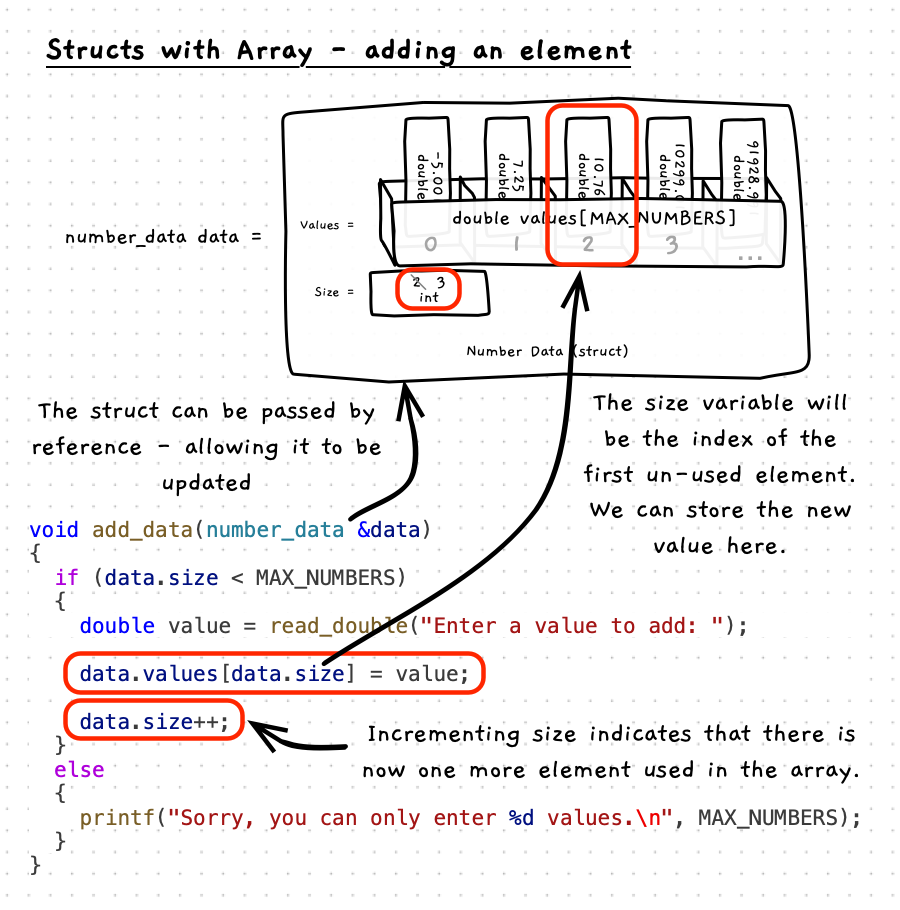

Now we can change the size of the array, up to a certain maximum, we can think about how an element can be added to an existing array. The process for this will involve:

1. Checking there is space
2. Adding the new data to the first available element.
3. Increasing the size value

This will then ensure that the new element is included in any subsequent processing.



:::note

- We can check the size against our maximum constant. This ensures we do not try to store more elements than we have space for.
- The value of the size variable will also be the index of the first available element. When processing we loop from index 0 to index size - 1, so the size value will always be where we want to store the next value.
- Incrementing the size will then ensure that subsequent processing will include the newly added value.

:::

## Example

```cpp {19-42,49-52}
#include <cstdio>
#include "utilities.h"

// The maximum number of values we can store
const int MAX_NUMBERS = 20;

/**
 * The data structure to store the numbers
 *
 * @field values the array of values
 * @field size the number of values in the array - up to MAX_NUMBERS
 */
struct number_data
{
  double values[MAX_NUMBERS];
  int size;
};

void add_data(number_data &data)
{
  // Check that we have space.
  if (data.size < MAX_NUMBERS)
  {
    // Ensure this works if size is negative
    if (data.size < 0)
    {
      // It was negative, so set it to 0.
      data.size = 0;
    }

    // Read the value in to the first available element
    double value = read_double("Enter a value to add: ");
    data.values[data.size] = value;
    // Increase the size
    data.size++;
  }
  else
  {
    // No space, so show an error
    printf("Sorry, you can only enter %d values.\n", MAX_NUMBERS);
  }
}

int main()
{
  // Initialise struct with an empty array and a size of 0.
  number_data data = {{},0};

  // We can add to the array a number of times
  add_data(data);
  add_data(data);
  add_data(data);

  // Loop through printing all values
  for (int i = 0; i < data.size; i++)
  {
    printf("%lf\n", data.values[i]);
  }

  return 0;
}
```
