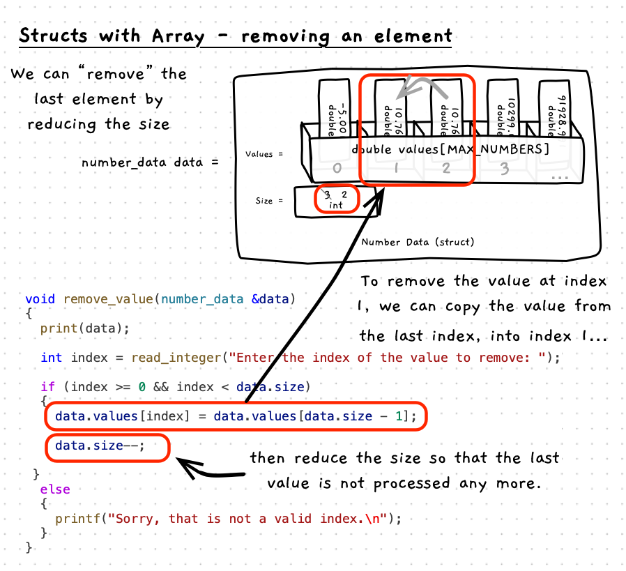

Now that we can add elements to the array within the struct, we can also remove elements from the array. The challenge here is that you can only adjust the size of the array, meaning that you can only remove the last element. One simple way to remove an individual element is to use its position in the array to save the current last element, and then reduce the size of the array by one. This is shown in the following illustration and example.



:::note

- Reducing the size of the array by one has the effect of removing an element - the last element.
- To remove a different element, you can use that elements position in the array to save the value of the last element, and then reduce the size of the array.
- The last index will be at `size - 1` for the respective struct.

:::

## Example

Notice how the code below checks the index is valid before attempting to remove the element. It is important to sanitise data, particularly in these functions that access array values. There are a range of security exploits that take advantage of code that does not perform these checks which can result in access to values you should not be able to access and potentially the ability to execute arbitrary code.

```cpp {24-35,49}
#include <cstdio>
#include "utilities.h"

// The maximum number of values we can store
const int MAX_NUMBERS = 20;

/**
 * The data structure to store the numbers
 *
 * @field values the array of values
 * @field size the number of values in the array - up to MAX_NUMBERS
 */
struct number_data
{
  double values[MAX_NUMBERS];
  int size;
};

/**
 * Remove a value from the array
 *
 * @param data the array of values
 */
void remove_value(number_data &data, int index)
{
  if (index >= 0 && index < data.size)
  {
    data.values[index] = data.values[data.size - 1];
    data.size--;
  }
  else
  {
    printf("Sorry, that is not a valid index.\n");
  }
}

int main()
{
  // Initialise struct with an empty array and a size of 0.
  number_data data = {{},0};

  // Save some data
  data.values[0] = 10;
  data.values[1] = 20;
  data.values[2] = 30;
  data.size = 3;

  // Remove the value at index 1
  remove_value(data, 1);
  
  // Loop through printing all values
  for (int i = 0; i < data.size; i++)
  {
    printf("%lf\n", data.values[i]);
  }

  return 0;
}
```
