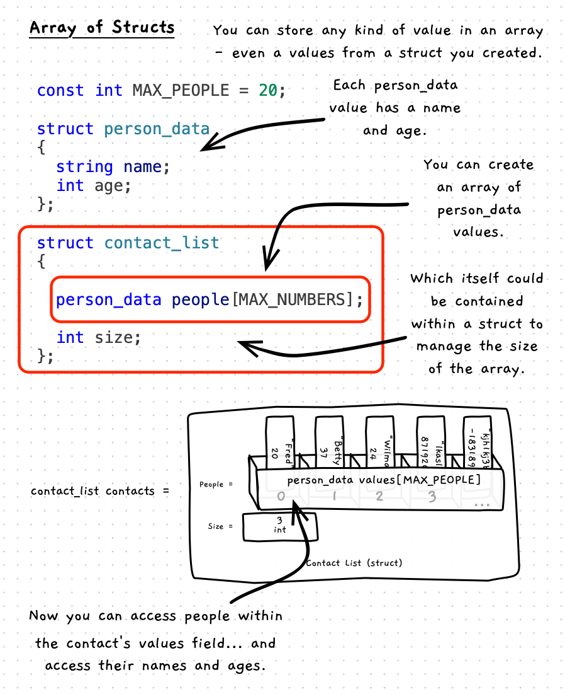

An array can contain any kind of data. So, you can have an array of a struct that you create. The following illustration shows an array of `person_data` values. This array is contained within a struct to manage the array, giving us a struct that contains an array that contains a different struct. With this flexibility you can start to model complex data, nesting data within other values as needed.



:::note

- Notice how each element in the array is now a person_data struct value, having a name and an age.
- We have seen how you can use a struct to manage an array, so here we use the same idea to create a contact list struct.
- Now when you access an element of the values array it is a person_data value.

:::

## Example

```cpp
#include <cstdlib>
#include "splashkit.h"

using std::to_string;

const int MAX_PEOPLE = 20;

struct person_data
{
  string name;
  int age;
};

struct contact_list
{
  // Here we have an array of people data values...
  person_data people[MAX_PEOPLE];
  int size;
};

void print_person(person_data &person)
{
  write_line("Name: " + person.name + " Age: " + to_string(person.age));
}

int main()
{
  // The contact list contains the array of people, and its current size
  contact_list contacts = {{}, 0};

  // You can also create local variables that are arrays of structs.
  person_data other_people[MAX_PEOPLE];

  // When you access 'people' each value is a struct
  contacts.people[0].name = "Fred"; // so we can access the name
  contacts.people[0].age = 20; // and we can access the age of any value

  contacts.people[1].name = "Betty";
  contacts.people[1].age = 37;

  contacts.people[2].name = "Wilma";
  contacts.people[2].age = 24;

  contacts.size = 3;

  for (int i = 0; i < contacts.size; i++)
  {
    // you can access each element as the struct data
    print_person(contacts.people[i]);

    // or access fields directly
    write_line("Name: " + contacts.people[i].name + " Age: " + to_string(contacts.people[i].age));
  }
  
  return 0;
}
```
