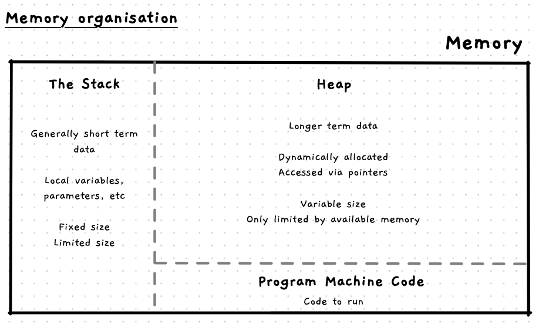

Before you can explore dynamic memory, you need to be aware of the *heap*. We can picture a program's memory as being organised into different segments: stack, code, and heap.

### Stack

The stack we have seen before, and has the following features:

- It stores local variables, parameters, and data associated with executing functions.
- Everything has a fixed size - and that size cannot change.
- Stack space is limited, set by the compiler when you create the program.
- It is generally used for short term storage as local variables go in and out of scope.
- This is called a stack, as things get added to the "top" and when they finish we return to previous frame (where the function was called from). Much like a *stack* of books where you always access it from the top.

All of your code so far has been working with the stack.

### Code

Our code also needs to be loaded into memory so that the computer is able to locate and use these as the instructions to be executed.

### Heap

The heap is the new space you need to become aware of. The heap has the following features:

- This space is used for longer term data and large data blocks that you want to refer in your code.
- Things can be flexible on the heap - changing size as you need.
- This space must be managed by your program.
- You can ask for space, ask to change the space allocated, and let the operating system know when you are finished with it.
- Unlike local variables, you cannot directly access data in the heap, instead you need to use pointers to refer to this space.

As you start to work with more complex data, and larger programs, you will need to start to use the heap to give you flexibility that is not available when you just use the stack.

:::tip

The key takeaways:

- You access data on the heap using pointers
- You can ask to be allocated space - and you will get access to a space on the heap.
- You can change the size of this space if needed.
- You must tell the operating system when you are finished with the space.

:::
