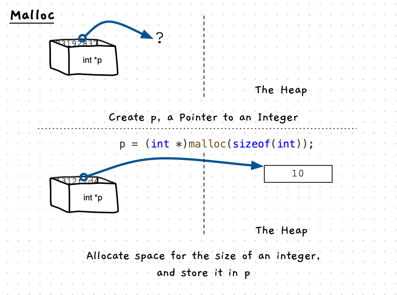
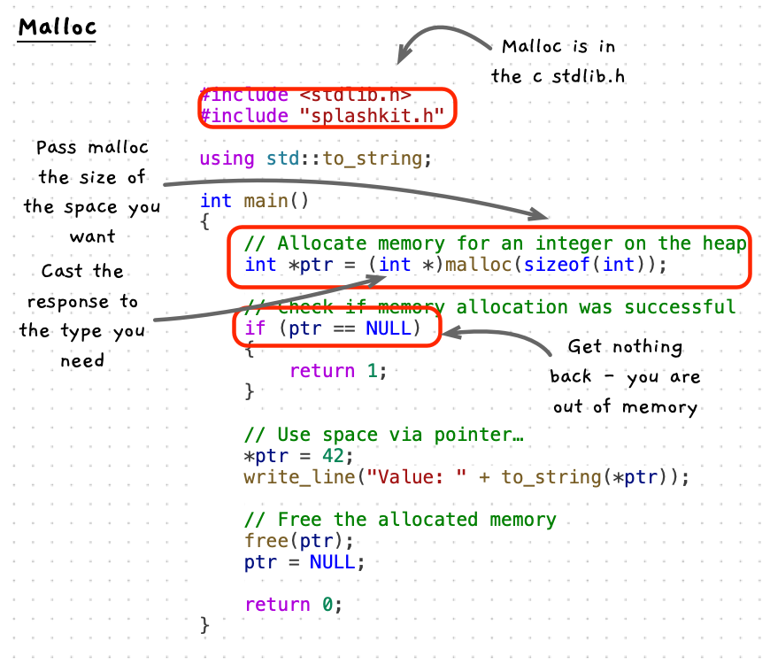

In C/C++ you can use the `malloc` function to ask to be allocated space in memory. You pass it the size of the space you are after, and it returns a pointer to the space you can use on the heap. The following image shows the overall idea of what we are aiming to achieve.



:::tip
Malloc = Memory Allocation
:::

The following image shows the code needed to allocate space on the heap.



:::note[Malloc...]

- accepts one parameter for the size of the memory to allocate in bytes.
- returns an untyped pointer to space on the heap.
- can be used with the `sizeof` function to make it easy to determine the size of different types.
- should have its response cast to the expected type.
- returns `NULL` when you are out of memory.

:::

:::tip
You can change the size of the space allocated to a pointer using [realloc](/book/part-2-organised-code/6-deep-dive-memory/2-trailside/03-4-realloc).
:::

## Example Code

The following example code uses `malloc` to create space for an integer, assigns it a value, and then free the allocation.

```cpp {1,9}
#include <stdlib.h>
#include "splashkit.h"

using std::to_string;

int main()
{
    // Allocate memory for an integer on the heap
    int *ptr = (int *)malloc(sizeof(int));
    
    // Check if memory allocation was successful
    if (ptr == NULL)
    {
        write_line("Memory allocation failed");
        return 1;
    }
    
    // Assign a value to the allocated memory
    *ptr = 42;
    
    // Print the value
    write_line("Value: " + to_string(*ptr));
    
    // Free the allocated memory
    free(ptr);
    ptr = NULL;
    
    return 0;
}
```
