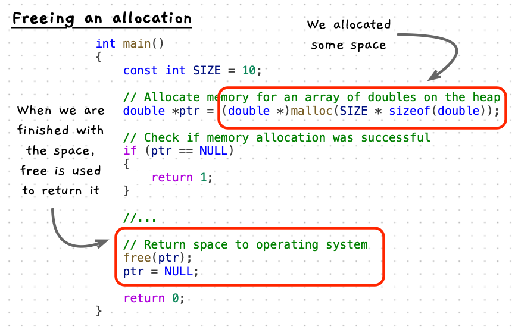

Memory is finite. When you allocate memory to your program, there is less memory available overall. So, when you are finished with a value on the heap, you need to free the allocation so that the memory can be used for other things.

:::note

Notice how the examples so far have a call to `free` at the end. This returns the space allocated to the pointer. It is also good practice to set the pointer to `NULL` so that you don't accidentally use it later.

:::



## Example Code

The following code uses free to return the allocated memory at the end of the program.

```cpp {32,33}
#include <stdlib.h>
#include "splashkit.h"

using std::to_string;

int main()
{
    const int SIZE = 10;

    // Allocate memory for an array of doubles on the heap
    double *ptr = (double *)malloc(SIZE * sizeof(double));
    
    // Check if memory allocation was successful
    if (ptr == NULL)
    {
        write_line("Memory allocation failed");
        return 1;
    }
    
    // Assign a value to the allocated memory
    ptr[0] = 73.37; // or *ptr = 73.37;
    ptr[1] = 42.0;
    //...
    
    // Print the value
    for(int i = 0; i < SIZE; i++)
    {
        write_line("Value at index " + to_string(i) + ": " + to_string(ptr[i]));
    }
    
    // Free the allocated memory
    free(ptr);
    ptr = NULL;
    
    return 0;
}
```

:::note
All memory allocated to your program is freed when it ends, but it is good practice to be thinking about the lifetime of the things you allocate on the heap and be freeing them yourself.
:::
